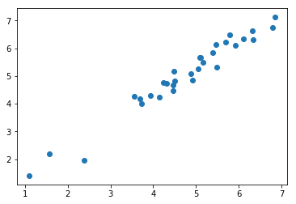

# Estimating the biomass of wild land mammals


```python
from scipy.stats import gmean
import sys
sys.path.insert(0,'../../../statistics_helper/')
from CI_helper import *
smil_estimate = 0.025e15
shai_meiri_estimate = 5454700007879

best_land_mammal_biomass = gmean([smil_estimate,shai_meiri_estimate])*0.15
land_mammal_CI = geo_CI_calc(np.array([smil_estimate,shai_meiri_estimate]))
```

# Estimating the biomass of wild marine mammals


```python
import pandas as pd
import numpy as np
import matplotlib.pyplot as plt
%matplotlib inline
comparison_data = pd.read_excel('marine_mammal_data.xlsx',index_col=0)
plt.scatter(np.log10(comparison_data['Biomass estimate from Christensen']),np.log10(comparison_data['Biomass estimate from IUCN']))
#comparison_data[['Biomass estimate from Christensen','Biomass estimate from IUCN']].plot()
#comparison_data.plot.scatter(x='Biomass estimate from Christensen',y='Biomass estimate from IUCN')
christensen = pd.read_excel('marine_mammal_data.xlsx','Christensen',skiprows=1,index_col=0)
best_christensen = christensen.loc[2000,'Mean']*0.15
best_IUCN = comparison_data['Biomass estimate from IUCN'].sum()*1e6*0.15

comparison_data.corr(method='spearman')
```


<div>
<style scoped>
    .dataframe tbody tr th:only-of-type {
        vertical-align: middle;
    }

    .dataframe tbody tr th {
        vertical-align: top;
    }

    .dataframe thead th {
        text-align: right;
    }
</style>
<table border="1" class="dataframe">
  <thead>
    <tr style="text-align: right;">
      <th></th>
      <th>Biomass estimate from IUCN</th>
      <th>Biomass estimate from Christensen</th>
    </tr>
  </thead>
  <tbody>
    <tr>
      <th>Biomass estimate from IUCN</th>
      <td>1.0000</td>
      <td>0.9753</td>
    </tr>
    <tr>
      <th>Biomass estimate from Christensen</th>
      <td>0.9753</td>
      <td>1.0000</td>
    </tr>
  </tbody>
</table>
</div>





# Estimating the total biomass of wild mammals


```python
best_wild_mammals = best_christensen+best_land_mammal_biomass
marine_mammal_CI = np.max([geo_CI_calc(np.array([best_IUCN,best_christensen])),christensen.loc[2000,'Max']/christensen.loc[2000,'Mean']])
mul_CI = CI_sum_prop(np.array([best_wild_mammals,best_christensen]), np.array([land_mammal_CI,marine_mammal_CI]))
mul_CI
```


    2.4085292902816984


